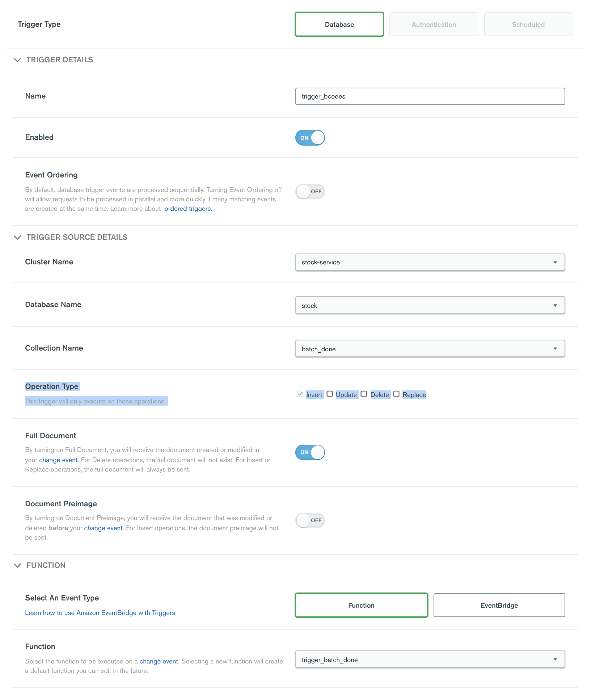

# Stock Service

## Installation

Install

* git
* python3

sudo pip3 install pymongo dnspython pysys

## Preparation

``` 
    cd testcases

    cp unix.properties.tmpl unix.properties
```

Edit `unix.properties` to point to

* Data dir for raw files
* location of mongodb tools - you'll need to install mongoimport from [here](https://www.mongodb.com/try/download/database-tools) 
* MongoDB Atlas Connection Strings

## Atlas Prep

1. Create an Atlas Cluster. An M30 is fine for a single test, prob M40 for prod.

2. Create a [Realm Application](https://docs.mongodb.com/realm/manage-apps/create/create-with-realm-ui/) and add a [Database Trigger](https://docs.mongodb.com/realm/triggers/database-triggers/) as shown below




(You might have to run all the Tests below once to get the collection name to show up)

3. Add `axios` as a dependency as shown [here](https://docs.mongodb.com/realm/functions/add-external-dependencies/)

4. Implement the `trigger_batch_done` function that will be called in response to the trigger

```js
exports = async function(changeEvent) {

    // Get inserted doc
    var batch_doc = changeEvent.fullDocument

    // Access a mongodb service:
    const bcodes_coll = context.services.get("stock-service-atlas").db("stock").collection("brstck_bcodes");
    const progress_coll = context.services.get("stock-service-atlas").db("stock").collection("batch_progress");
    
    const bcodes = await bcodes_coll.find({'batch_index' : batch_doc.batch_index}).toArray();
    
    const axios = require('axios');
    const config = { headers: { 'content-type': 'application/json' }};
    const response = await axios.post('https://64bc8cfd-2263-488c-b76a-75c230ebbb0f.mock.pstmn.io/JDS_Test', JSON.stringify(bcodes), config);
    console.log(JSON.stringify(response.data));

    return progress_coll.updateOne({}, { $inc : { 'batches_done' : 1, 'bcodes_inserted' : bcodes.length}});
};
```

Obviously change the URL that you are posting to - this is just a Postman Mock Server


## Files

This was tested against

- *_XML-BRSTCK*.xml files
- SkuInfo. Run this command to convert the pipe delimited file to TAB delimited so it can be imported via mongoimport

`cat SKUInfo_ALLSites.txt | sed -E 's/\|/\t/g' > SKUInfo_ALLSites_TAB.txt`

All these files are in a directory called `~/data/mongodb/jdsports` on my laptop. Edit `unix.properties` as necessary to point to where they live

## Running the tests

The imports are written as tests using a Python test framework called [Pysys](https://github.com/pysys-test/pysys-test), which is framework designed to assist in creating system level test. Each pysys test is in a directory with test code (```run.py```) and directories for input and output.

To run a test, open a command shell and navigate to the testcases folder. In that folder there are separate folders for the tests. 

Run the test in this order

1. `pysys run 1_import_data` - This imports all the *_XML-BRSTCK*.xml files
1. `pysys run 2_import_skuinfo` - This imports skuinfo via mongoimport
1. `pysys run 3_transform_raw_data` - This runs a few transformations to tidy up the data
1. `pysys run 4_brstck_bcodes` - This joins btsrck and skuinfo to create the output barcode information. This populuate the `batch_done` which is being picked up by the trigger as defined above.

All the code for the realm app is [here](./realm-app)

